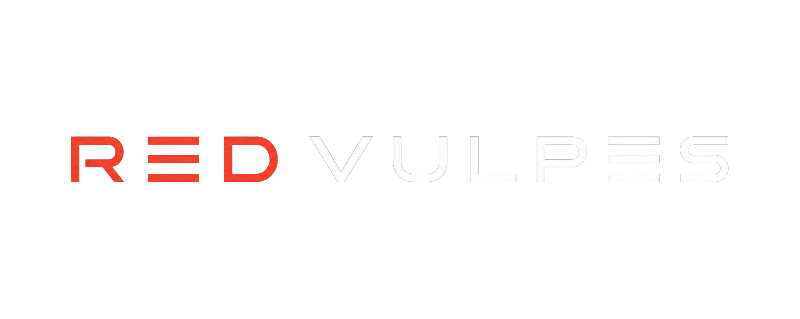
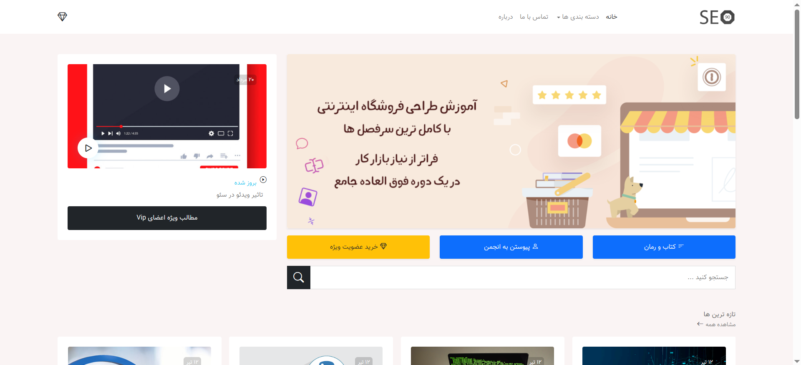
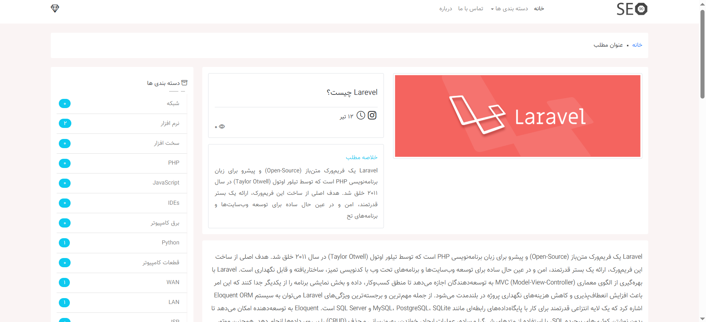
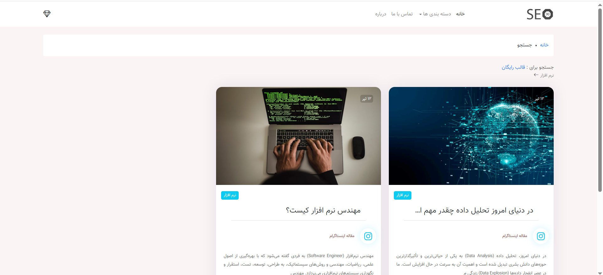
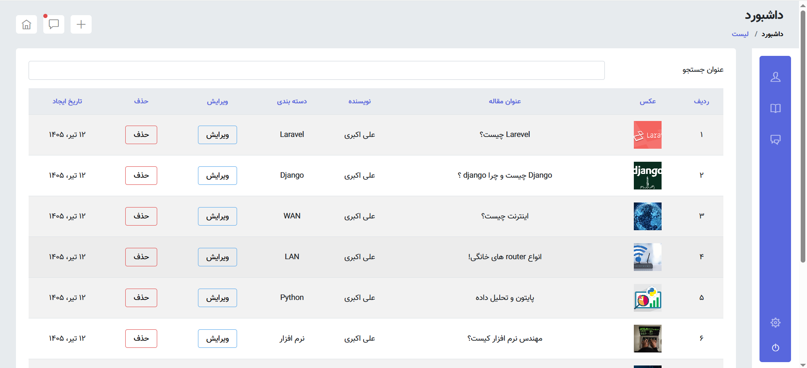
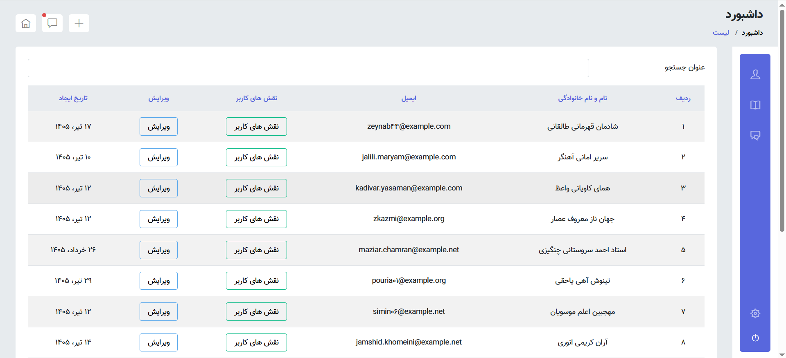
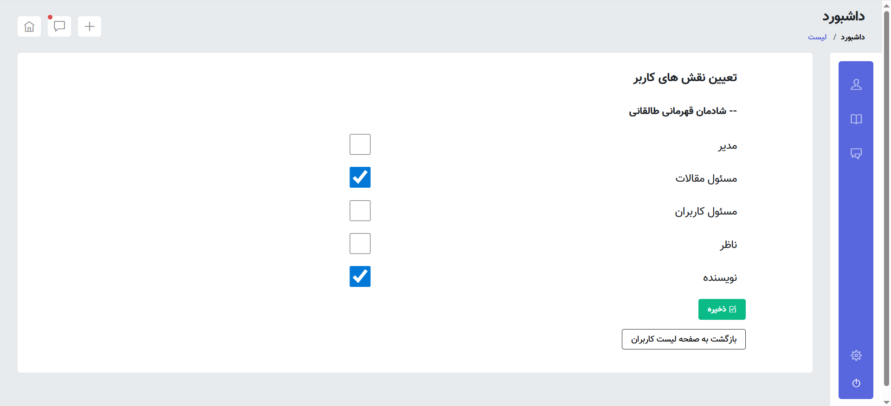

# Laravel Blog Platform

<p align="center">
  
  
  
  
  
</p>

A Laravel-based blog platform designed for publishing articles across multiple categories. It features a comprehensive role-based administration dashboard with authentication, user and role management, article and category management, comment moderation, and search functionality.

> **Note:** This project was built as part of my Laravel learning journey and is continuously improved by applying new concepts, refactoring the codebase, and adding new features.

## 📸 Screenshots

### 🏠 Home Page



---

### 📄 Article Page



---

### 📂 Category Posts



---

### 📝 Articles Management



---

### 👥 Users Management



---

### 🔐 User Roles Management



## ✨ Features

### 🔐 Authentication System
- **Registration & Login** – Users can create an account and log in securely.
- **Email Verification** – New users must verify their email address before accessing the site.
- **Password Reset** – Users can reset their password via email using Laravel Fortify.
- **Validation:** All inputs are validated on both client and server sides using Laravel’s built-in validation rules and custom messages.

### 👑 Role-Based Admin Panel (RBAC)
A comprehensive admin panel with **Role-Based Access Control (RBAC)**. Access to each section is determined by the user's role.

The panel includes three main sections:

1. **User Management** – Manage users and assign roles.
2. **Article Management** – Manage categories and articles.
3. **Comment Management** – Moderate and approve/reject user comments.

All sections support full **CRUD operations**.

### 🧑‍💼 User Roles (5 Default Roles)
- **Manager** – Full site management.
- **User Admin** – Manages users and roles.
- **Article Admin** – Manages articles and categories.
- **Supervisor** – Monitors content and approves comments.
- **Author** – Creates and manages own articles.

> **Note:** The site manager can add or remove roles as needed. However, custom role permissions require developer intervention.

- **Guest Users** – Visitors can register to comment. Registered users without a role are treated as regular users.

### 📝 Article Management
- Create new articles with title, summary, full content, and featured image.
- Assign articles to categories.
- Edit or delete existing articles from the list.
- Articles can be saved as drafts or published.

### 💬 Comment System
- Users must be logged in to post comments.
- All comments are **moderated** – they must be approved by a manager or supervisor before becoming visible.
- Admins and supervisors can reply to comments, which appear as **"Admin Response"** on the frontend.

### 🔍 Search 

- Search functionality will be implemented using **Laravel Livewire** in a future update.

### 📊 Statistics & Analytics
- **Frontend Stats:** Article views, category post counts, recently published articles, and more.
- **Admin Dashboard:** Advanced analytics will be added in future updates.

### 📂 Category Hierarchy
- Categories are displayed with **branch relationships** (parent-child structure) on the client side.

### 🕒 Recent Posts
- A "Recent Posts" section shows the latest articles based on creation date.

### 🌐 Localization & UI
- All dates are displayed using **Jalali (Shamsi) calendar** with **human-readable** formats.
- **RTL & LTR** fully supported for Persian and English content.
- **Validation errors** and system messages are fully localized in Persian.
- **AJAX & JavaScript** used for enhanced UI/UX (e.g., SweetAlert2 for confirmations).
- **Two-step deletion** (confirm + delete) for admin actions to prevent accidental removals.

### 📱 Responsive Design
- The site is fully responsive, though frontend development was handled by a separate team.

### 🔄 Continuous Improvement
- This project is **actively maintained** and new features will be added regularly.

## 🛠️ Tech Stack

### Backend
- **Framework:** Laravel 13 (latest version)
- **Language:** PHP v8.3
- **Database:** MySQL
- **Authentication:** Laravel Fortify
- **Validation:** Laravel built-in validation with custom error messages (localized in Persian)

### Frontend
- **Framework/Library:** Bootstrap 4 & 5 , jQuery
- **Rich Text Editor:** CKEditor
- **Build Tool:** Vite
- **JavaScript Utilities:** SweetAlert2, AJAX

### Localization
- **Multi-language support:** Persian (fa) as primary language for frontend messages and validation errors.

### Development Tools
- **Package Manager:** Composer (PHP), NPM (Node.js)
- **Development Environment:** Laragon
- **Database Management:** phpMyAdmin

> **Note:** Frontend design and styling were handled by a dedicated frontend team, ensuring a fully responsive and user-friendly interface.

## 🚀 Installation & Setup

Follow these steps to get the project up and running on your local machine.

### Prerequisites
- PHP 8.3 or higher
- Composer
- Node.js & NPM
- MySQL Database (or any compatible database)

### Step-by-Step Guide

1. **Clone the repository**
   ```bash
   git clone https://github.com/redvulpesio/laravel-blog-platform.git
   cd laravel-blog-platform
   ```

2. **Install PHP Dependencies**
   ```bash
   composer install
   ```

3. **Install Frontend Dependencies**
   ```bash
   npm install
   npm run build   # Build frontend assets for production
                   # For development, use: npm run dev
   ```

4. **Environment Configuration**
   ```bash
   cp .env.example .env
   ```
   Now open the `.env` file and update your database credentials:
   ```
   DB_CONNECTION=mysql
   DB_HOST=127.0.0.1
   DB_PORT=3306
   DB_DATABASE=laravel_blog_db   # or your custom database name
   DB_USERNAME=your_database_user
   DB_PASSWORD=your_database_password
   ```

5. **Generate Application Key**
   ```bash
   php artisan key:generate
   ```

6. **Run Database Migrations & Seeders**
   ```bash
   php artisan migrate --seed
   ```
   This will create all required tables and seed default roles and a test user.

7. **Storage Link (Optional)**
   > **Note:** By default, uploaded images are stored directly in the `public` directory. This step is only required if you plan to use Laravel's `storage` disk for file uploads.
   ```bash
   php artisan storage:link
   ```

8. **Start the Development Server**
   ```bash
   php artisan serve
   ```
   Your application will be available at `http://127.0.0.1:8000`

### Default Login Credentials (After Seeding)
- **Email:** `admin@example.com`
- **Password:** `password`

---

### 🧪 Running Tests (Optional)
```bash
php artisan test
```

## 🤝 Contributing

Contributions are what make the open-source community such an amazing place to learn, inspire, and create. Any contributions you make are **greatly appreciated**.

If you have a suggestion that would make this better, please fork the repo and create a pull request. You can also simply open an issue with the tag "enhancement".

1. Fork the Project
2. Create your Feature Branch (`git checkout -b feature/AmazingFeature`)
3. Commit your Changes (`git commit -m 'Add some AmazingFeature'`)
4. Push to the Branch (`git push origin feature/AmazingFeature`)
5. Open a Pull Request

## 📄 License

Distributed under the MIT License. See [LICENSE](LICENSE) file for more information.

> **Note:** This project is open-source and free to use, modify, and distribute under the terms of the MIT license.

## 📞 Contact

- **Email:** redvulpesio@gmail.com
- **Telegram:** @redvulpesio
- **GitHub:** [github.com/redvulpesio](https://github.com/redvulpesio)
- **LinkedIn:** *Soon*
- **Website:** *Soon*

Feel free to reach out for collaboration, job opportunities, or any questions about the project.

<p align="center">
  <strong>Copyright &copy; 2026 redvulpes</strong>
</p>

